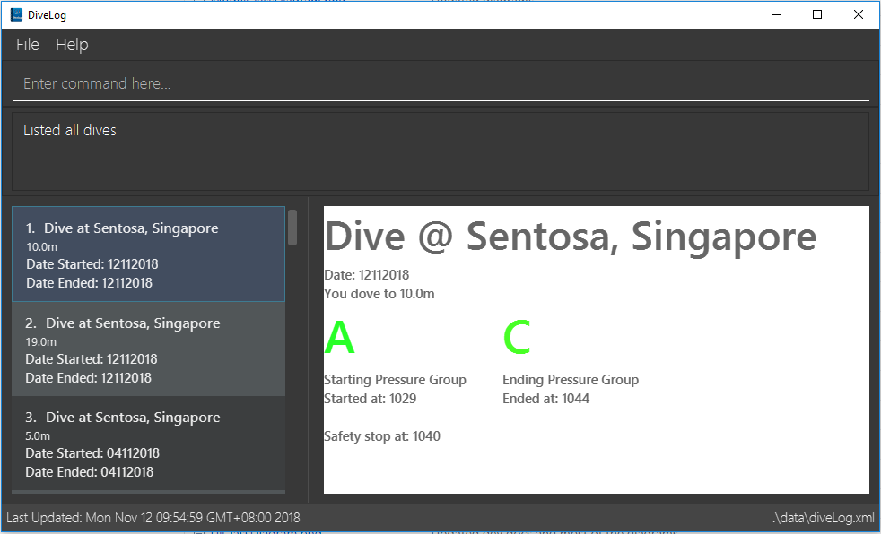

= DiveLog
ifdef::env-github,env-browser[:relfileprefix: docs/]

https://travis-ci.org/nusCS2113-AY1819S1/addressbook-level4[image:https://travis-ci.org/nusCS2113-AY1819S1/addressbook-level4.svg?branch=master[Build Status]]

ifdef::env-github[]

endif::[]

ifndef::env-github[]
image::images/Ui.png[width="600"]
endif::[]

* This is a desktop Dive Log. It has a GUI but most of the user interactions happen using a CLI (Command Line Interface).

== Motivation

When a diver goes on a dive, the pressure underwater causes nitrogen to build up in the blood stream. When the diver returns to the surface, he or she has that level of nitrogen in his or her blood. However, due to the atmospheric pressure being lower than underwater, the partial pressure of nitrogen is different. Having too much nitrogen build up can be dangerous particularly if you are planning a second dive or going on a flight as the nitrogen can form bubbles inside one’s bloodstream. In order to solve this problem, divers manually calculate their “pressure groups”. The pressure groups are on a range from A,B,C all the way to Z. Depending on your pressure group you can attempt your next dive. It is generally advised to avoid ending a dive with a pressure group of "W", "X", "Y", and "Z" or you would need to have a minimum surface interval of one hour if you end with "W" or "X", and three hours if you end with "Y" or "Z".

== Site Map

* <<UserGuide#, User Guide>>
* <<DeveloperGuide#, Developer Guide>>
* <<LearningOutcomes#, Learning Outcomes>>
* <<AboutUs#, About Us>>
* <<ContactUs#, Contact Us>>

== Acknowledgements

* This application was built for NUS CS2113T AY2018/2019 Semester 1 and is based off https://nuscs2113-ay1819s1.github.io/addressbook-level4/[addressbook level 4]
* Libraries used: https://github.com/TestFX/TestFX[TextFX], https://bitbucket.org/controlsfx/controlsfx/[ControlsFX], https://github.com/FasterXML/jackson[Jackson], https://github.com/google/guava[Guava], https://github.com/junit-team/junit5[JUnit5]

== Licence : link:LICENSE[MIT]

